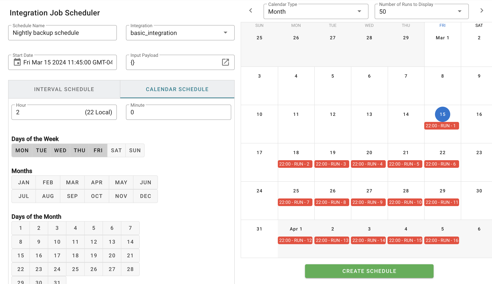

# Integration Scheduler

The _Integration Scheduler_ allows an integration to be run on a pre-determined schedule.&#x20;

Schedules can be set in terms of time intervals with millisecond granularity, or by specifying the day(s)-of-week or day(s)-of-month. Scheduled integrations will run until the schedule is disabled.&#x20;

<figure><figcaption>
<em>Integration Scheduler</em> showing creation of an "every weekday" schedule
</figcaption></figure>

Scheduled integrations must be provided with a static payload at the time the schedule is created.
