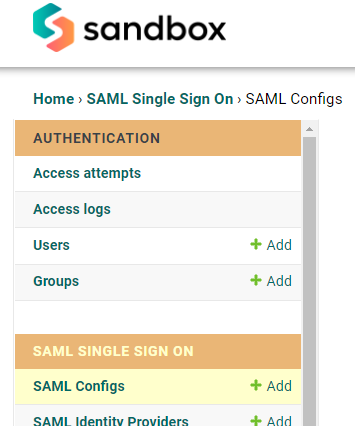
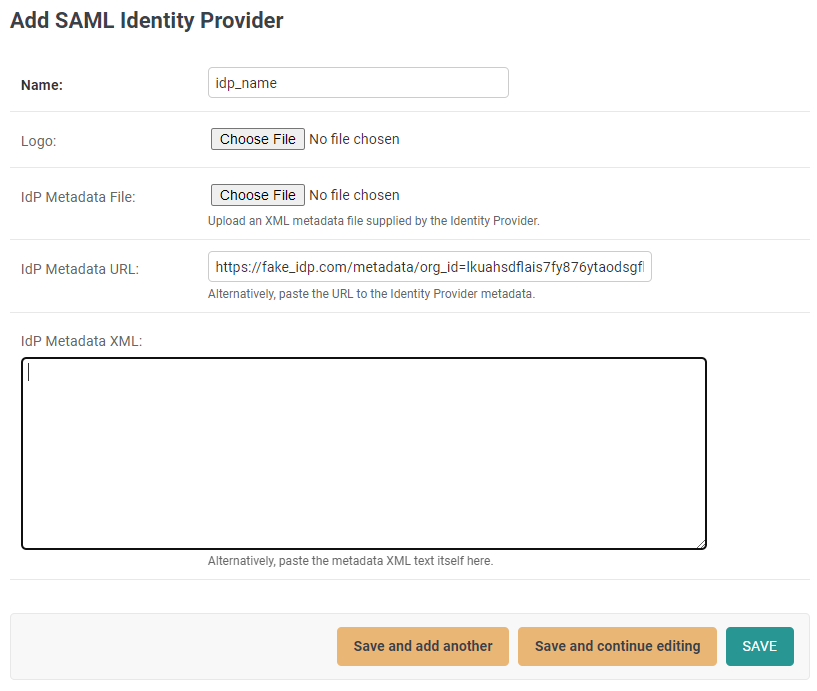

# Glyue Setup


Before continuing, this user should be a Glyue administrator for the target environment.


### Create a SAML Config 

Log into Glyue and navigate to the Admin site.

Scroll to the **SAML SINGLE SIGN ON** section, locate **SAML Configs** and click **Add**.

<figure><figcaption></figcaption></figure>

On the web form that displays, scroll to the bottom (without changing any values) and click **SAVE**.

<figure><figcaption></figcaption></figure>

Default SAML settings are considered secure and should suffice for most use cases.


See [SAML Config Reference](https://app.gitbook.com/o/hMR7ZmLUVPDLpu0EFvkY/s/1flQ2To8tQpCQWl2Ty9U/\~/changes/60/configure-saml-based-sso/saml-config-reference) for all SAML configuration options.


Note that on the resulting page, there is now a URL and a download link for Glyue’s SAML metadata:

<figure><figcaption></figcaption></figure>

This URL (or the downloaded file) will need to be provided to the admin on the IdP side.


See these articles for setting up SSO with Glyue on the IdP side:

[Okta ](https://app.gitbook.com/o/hMR7ZmLUVPDLpu0EFvkY/s/1flQ2To8tQpCQWl2Ty9U/\~/changes/60/configure-saml-based-sso/okta-sso)| [JumpCloud ](https://app.gitbook.com/o/hMR7ZmLUVPDLpu0EFvkY/s/1flQ2To8tQpCQWl2Ty9U/\~/changes/60/configure-saml-based-sso/jumpcloud-sso)| [Azure](https://app.gitbook.com/o/hMR7ZmLUVPDLpu0EFvkY/s/1flQ2To8tQpCQWl2Ty9U/\~/changes/60/configure-saml-based-sso/azure-sso)


### Adding an Identity Provider 


The IdP must have added Glyue to the IdP as a service provider / application.

An administrator to the IdP should provide their IdP metadata, either as a URL or an XML file.


On the Admin site, under **SAML SINGLE SIGN ON**, locate **SAML Identity Providers** and click **+Add**.

Provide a name, optionally a logo image, and the metadata.

<figure><figcaption></figcaption></figure>

Click **SAVE**. Glyue should now allow users to log in via this provider.

### Testing connectivity 

Log out of Glyue and go to the main page. The login dialog should have a new section, **Single Sign On**, and the added IdP’s name should appear on a button.

Clicking the button should redirect the user to the IdP login page. After successful authentication, the user should be redirected back to Glyue, bypassing the login screen and going right to the requested page.


If the user encounters a **403 Access Denied** error after authenticating, this means Glyue was unable to locate a user based on the information provided by the IdP. This is most likely due to one of the following issues:

1. The user in Glyue is not active or doesn't exist.
2. The user’s email address in Glyue does not match exactly to the email address at the IdP.
3. The IdP has not been properly configured to include the user email address in the information it submits to Glyue for SSO.
4. The name of the email address user attribute is different between Glyue and the IdP. This can be solved by adding an attribute mapping on the SAML Config page.  Some IdPs also have this optionality on their end.\
   See [SAML Config Reference](https://app.gitbook.com/o/hMR7ZmLUVPDLpu0EFvkY/s/1flQ2To8tQpCQWl2Ty9U/\~/changes/60/configure-saml-based-sso/saml-config-reference).

