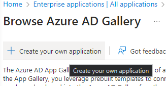

# Azure Setup


Before continuing, this user should be an Azure AD admin for the organization, and a SAML Config must be created in the Glyue Environment.


### Create the Glyue Enterprise Application 

From the Azure Active Directory overview page, select **Enterprise applications** from the left-hand panel.

<figure><figcaption></figcaption></figure>

Click **New Application** at the top.

<figure><figcaption></figcaption></figure>

Click **Create your own application** at the top.

<figure><figcaption></figcaption></figure>

Provide a name and select **Integrate any other application you don’t find in the gallery (Non-gallery)**. Click **Create** at the bottom of the page.

<figure><figcaption></figcaption></figure>

Click **2. Set up single sign on** under **Getting Started**, or select **Single sign-on** from the left-hand panel.

<figure><figcaption></figcaption></figure>

Select **SAML**.

<figure><figcaption></figcaption></figure>

### Provide Glyue’s metadata to Azure 


The Glyue environment SAML metadata will be required for the next step.

Glyue always serves its metadata at `https://` (custom domain) `/sso/saml2/metadata/`. If this user is also a Glyue administrator, the metadata URL will be displayed on the **Admin** site under **SAML Configs**.


At the top, select **Upload metadata file.** Select the appropriate file and upload.

<figure><figcaption></figcaption></figure>

Click **Save** at the top.

<figure><figcaption></figcaption></figure>

### Add an email claim 

We need to add a claim to the SAML configuration in Azure, so that the user’s email address comes over to Glyue in a field titled “email” instead of something else.

On the application **SAML-based Sign-on** page, in section **2 Attributes & Claims** click **Edit**.

<figure><figcaption></figcaption></figure>

Click **Add new claim** at the top.

<figure><figcaption></figcaption></figure>

Enter `email` in the **Name** field. For **Source Attribute** select `user.mail`. Click **Save** in the top-left.

<figure><figcaption></figcaption></figure>

Depending on the organization’s Azure configuration, the user email field name may differ.

### Get Azure SAML metadata for Glyue 

On the application **SAML-based Sign-on** page, in section **3** under **SAML Certificates** download the **Federation Metadata XML**.

<figure><figcaption></figcaption></figure>

Alternatively, grab the **App Federation Metadata Url** instead of downloading the file.

This will be needed on the Glyue side, to add Azure as an IdP. If this user is not a Glyue admin, please provide the file/URL to a Sandbox Banking employee.


### Lastly… 

Don’t forget to assign users or groups to the new application- otherwise they won’t be able to authenticate with Glyue via SSO.

