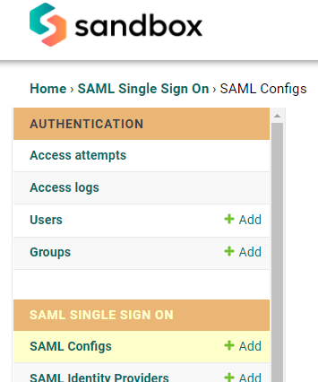
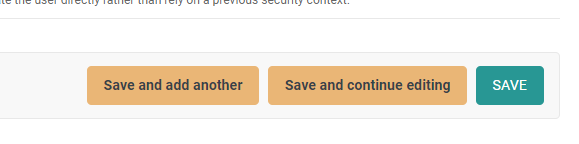
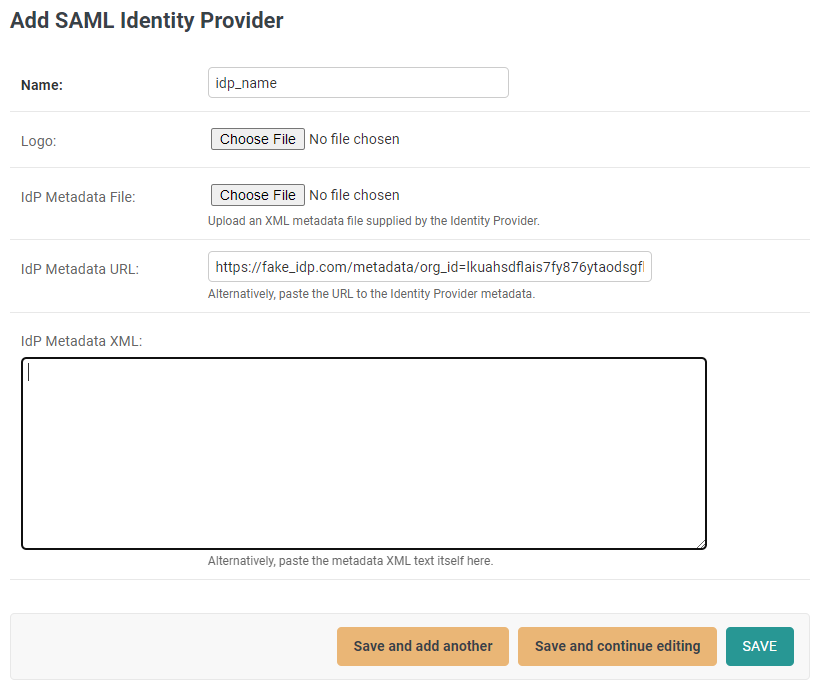

# Glyue Setup


Before continuing, this user should be a Glyue administrator for the target environment.


### Create a SAML Config 

Log into Glyue and navigate to the Admin site.

Scroll to the **SAML SINGLE SIGN ON** section, locate **SAML Configs** and click **Add**.

<figure><figcaption></figcaption></figure>

On the web form that displays, scroll to the bottom (without changing any values) and click **SAVE**.

<figure><figcaption></figcaption></figure>

Default SAML settings are considered secure and should suffice for most use cases.  If SSO customization is desired, please see this article:


[glyue-saml-config-reference.md](glyue-saml-config-reference.md)


Note that on the resulting page, there is now a URL and a download link for Glyue’s SAML metadata:

<figure><figcaption></figcaption></figure>

Provide the URL or metadata file to the IdP admin, who now must add Glyue on their end as an external SSO application (aka Service Provider) and supply their IdP SAML metadata.

### General IdP Setup

1. Create a new Service Provider (aka SSO Application, External Application, SSO Integration, SAML Application, etc. or something similar).
2. Upload the Glyue metadata. Some IdPs won't support uploading a file, and will prefer a URL or even for the data to be copied and pasted.&#x20;


Glyue always serves its metadata at `/sso/saml2/metadata/`.

Also, Glyue's metadata can be downloaded from the **SAML Configs** page on the **Admin** site.  The page will also display the full URL.


3. Configure as necessary, add users, map user attributes, etc.


By default, a user's email address is used to identify the correct user for login in Glyue. The attribute (aka field) on the Glyue User object is simply `email`, which may differ from the IdP's User object (which might be`emailAddress`, `email_addr`, or something similar).

In this case, the IdP user email address attribute name needs to be mapped to Glyue's.  Glyue supports user attribute mapping on its end, and most IdPs do as well.

See [glyue-saml-config-reference.md](glyue-saml-config-reference.md "mention") for more information.


5. Save/activate/enable the new SSO application.
6. There should now be SAML metadata available which should be provided back to the Glyue admin.

### IdP-specific setup instructions


[jumpcloud-setup.md](jumpcloud-setup.md)



[okta-setup.md](okta-setup.md)



[azure-setup.md](azure-setup.md)


### Add the IdP to Glyue as a trusted authenticator 


Before continuing, Glyue should be configured and active in the IdP, and the IdP's SAML metadata should be available.


On the Admin site, under **SAML SINGLE SIGN ON**, locate **SAML Identity Providers** and click **+Add**.

Provide a name, optionally a logo image, and the metadata.

<figure><figcaption></figcaption></figure>

Click **SAVE**. Glyue should now allow users to log in via this provider.

### Testing connectivity 

Log out of Glyue and go to the main page. The login dialog should have a new section, **Single Sign On**, and the added IdP’s name should appear on a button.

Clicking the button should redirect the user to the IdP login page. After successful authentication, the user should be redirected back to Glyue, bypassing the login screen and going right to the requested page.


If the user encounters a **403 Access Denied** error after authenticating, this means Glyue was unable to locate a user based on the information provided by the IdP. This is most likely due to one of the following issues:

1. The user in Glyue is not active or doesn't exist.
2. The user’s email address in Glyue does not match exactly to the email address at the IdP.
3. The IdP has not been properly configured to include the user email address in the information it submits to Glyue for SSO.
4. The name of the email address user attribute is different between Glyue and the IdP. This can be solved by adding an attribute mapping on the SAML Config page.  Some IdPs also have this optionality on their end.\
   \
   See [glyue-saml-config-reference.md](glyue-saml-config-reference.md "mention")

