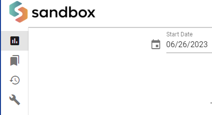

# How to use the Vault

The Glyue vault feature provides a way for configuration, secrets, and state to be read and written by integrations.

More specifically, it is an API for storing and retrieving JSON in the database, as well as a page in the Glyue application to manage the stored content.


Some useful vault vocabulary:

* A "Vault Item" is a JSON object with a name, it can be read or written by integrations, as well as on the vault page.
* A "Vault Secret" is like a Vault Item, except that it cannot be read on the vault page, only written.
* A "Vault" is a named collection of Vault Items and Secrets


**This guide will explain how to:**

1. Create a vault
2. Create a vault item
3. Configure your integration to have access to the vault
4. Read the vault item in an integration hook


Prerequisites:

* This guide expects you are familiar with the build page and editing integrations
* You must be a superuser or have the "can view vault" permission

## Creating a Vault

First, you must create a "Vault". This allows for your items and secrets to be logically organized.

1\) Navigate to the vault page by clicking the vault icon on the sidebar: 

2\) Press the "+ Create Vault" button .png>)

3\) Name your vault "my-vault" in the modal , then press "Create Vault"

<figure><figcaption></figcaption></figure>


## Creating a Vault Item

Next, we'll create an item in the vault. This is the item your integration will read at runtime.

1\) Select "my-vault" in the leftmost column

2\) Press "+ Create Vault Item" .png>)

3\) In the modal, provide the name "my-item" for your vault item, and in the text editor, provide some valid JSON.

<figure><figcaption></figcaption></figure>

4\) Press "+ Create Vault Item"

You vault item is now saved, and can be seen on the vault page

<figure><figcaption></figcaption></figure>


## Connecting your integration to the Vault

This step assumes you have an existing integration called "my-integration"

1\) Navigate to the admin page by pressing the profile icon on the top-right of Glyue and select "Admin".png>)

2\) On the page that appears, scroll to and click on "+ Add" next to "Vault Permissions"

<figure><figcaption></figcaption></figure>

3\) Fill out the form to give "my-integration" permission to read from "my-vault"

<figure><figcaption></figcaption></figure>

4\) Press save

5\) Return to the Glyue Application by pressing "View Site" on the top-right corner of your screen

<figure><figcaption></figcaption></figure>

## Read the vault within your integration

First - some important concepts about the vault:

A given vault can only be opened by one running integration at a time. If another integration tries to open a vault that is already open, it will halt until the other running integration closes it.

For this reason, it is important to always close a vault when you are done using it. We make this easy by providing a vault context manager (The python 'with' statement)

Here is the code we will be putting into our integration before hook:

```python
with open_vault('my-vault') as vault:
    my_data = vault.get("my-item")
# The with statement automatically closes the vault at this point
debug(my_data, label="Here's what was in the vault")
```

If you do the above, and run your integration, you should see this in your run history

<figure><figcaption></figcaption></figure>

If you want your vault contents to be accessible throughout the rest of your integration (meaning, not just within the before\_hook), you can `keep` my\_data:

```python
with open_vault('my-vault') as vault:
    my_data = vault.get("my-item")
debug(my_data, label="Here's what was in the vault")
keep(my_data = my_data) # my_data can now be accessed in any other hook or expression
```
