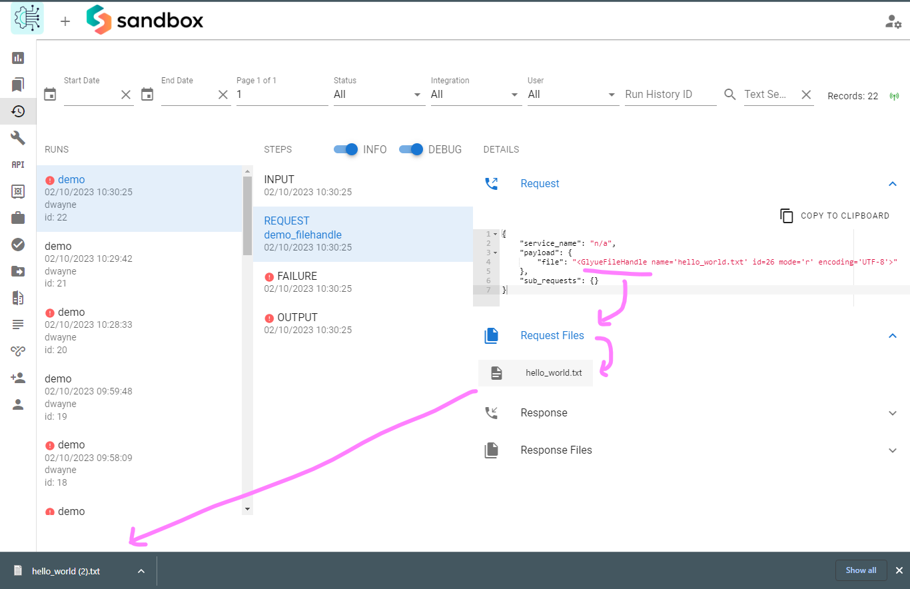

# open\_glyuefile

## Overview <a href="#open_glyuefile-overview" id="open_glyuefile-overview"></a>

`open_glyuefile()` returns a `GlyueFileHandle` object that serves as an interface to an encrypted file (`GlyueFile`) in the database. It is meant to almost identically mimic the built-in Python function `open()`:

```python
# Open a new file and write to it
file = open_glyuefile("hello_world.txt", mode="x", encoding="utf-8")
file.write("Hello world!")
file.close()
```

`open_glyuefile()` also supports usage in a context manager:

```python
# Open an existing file (defaults to read-text mode and UTF-8 encoding)
with open_glyuefile("hello_world.txt") as file:
    content = file.read()
    debug(content, "file content")
# file is now closed
file.write("This will cause error!") # Raises UnsupportedOperation exception
```

## Programmer Interface <a href="#open_glyuefile-programmerinterface" id="open_glyuefile-programmerinterface"></a>

### **open\_glyuefile(**_filename: str, mode='r', encoding=None_**)** <a href="#open_glyuefile-open_glyuefile-filename-str-mode-r-encoding-none" id="open_glyuefile-open_glyuefile-filename-str-mode-r-encoding-none"></a>

Open a `GlyueFile` from the database matching the given filename and tied to the current `IntegrationRunHistory` and return a corresponding `GlyueFileHandle` object.

_filename_ is a string representing the name of the file without any path. Since an actual file on disk is not being opened, no path is needed. Do not put slashes in your _filename_. Only one file with any given name can exist in the same integration run, but the same name can be reused across runs.

_mode_ is an optional string that specifies the mode in which the file should be opened. The same modes available in Python’s builtin `open()` function are available here. Common modes include ‘`r'` for reading, ‘`w'` for writing (truncating the file if it already exists), ‘`x'` for explicit creation, and `'a'` for appending (all writes are done to the end of the file regardless of seek position). In text mode, if _encoding_ is not passed, the encoding defaults to UTF-8.

Available modes are:

| `'r'` | open for reading (default), fails if file does not exist                         |
| ----- | -------------------------------------------------------------------------------- |
| `'w'` | open for writing, truncating the file first, opens new file if it does not exist |
| `'x'` | open for exclusive creation, failing if the file already exists                  |
| `'a'` | open for writing, appending to the end of file if it exists                      |
| `'b'` | binary mode                                                                      |
| `'t'` | text mode (default)                                                              |
| `'+'` | open for updating (reading and writing)                                          |

The default mode is `'r'` (open for reading text, a synonym of `'rt'`). Modes `'w+'` and `'w+b'` open and truncate the file. Modes `'r+'` and `'r+b'` open the file with no truncation.

### GlyueFileHandle methods and properties <a href="#open_glyuefile-glyuefilehandlemethodsandproperties" id="open_glyuefile-glyuefilehandlemethodsandproperties"></a>

| **attribute**                        | **type / returns** | **description**                                                                                                                                                                          |
| ------------------------------------ | ------------------ | ---------------------------------------------------------------------------------------------------------------------------------------------------------------------------------------- |
| `close()`                            | `None`             | clears the buffer and closes the file                                                                                                                                                    |
| `closed`                             | `bool`             | value representing whether the file is closed or not                                                                                                                                     |
| `encoding`                           | `str\|None`        | value of the encoding the file was opened with                                                                                                                                           |
| `fileno()`                           | `int`              | returns the database id of the underlying `GlyueFile`                                                                                                                                    |
| `flush()`                            | `None`             | writes changes (if any) to the database                                                                                                                                                  |
| `mode`                               | `str`              | the mode the file was opened in                                                                                                                                                          |
| `name`                               | `str`              | the filename                                                                                                                                                                             |
| `read(size=-1)`                      | `bytes\|str`       | returns the next `size` chars/bytes from the buffer current position, or the entire contents if no `size` is passed                                                                      |
| `readable()`                         | `bool`             | returns `True` if the file is readable in its current mode, else `False`                                                                                                                 |
| `readline(size=-1)`                  | `bytes\|str`       | returns the next `size` chars/bytes from the buffer current position, or all characters/bytes until the next newline char if no `size` is passed                                         |
| `readlines(hint=-1)`                 | `list[bytes/str]`  | returns a list of the next `hint` lines or a list of all lines if no `hint` arg is passed                                                                                                |
| `seek(position: int, whence=0)`      | `int`              | sets the buffer to the current `position` from `whence` (`0` from beginning of file, `1` from current position, `2` from end of file) and returns the new buffer position as an `int`    |
| `seekable()`                         | `bool`             | returns `True` if `seek()` can be currently used, else `False`                                                                                                                           |
| `tell()`                             | `int`              | returns the current position of the buffer                                                                                                                                               |
| `truncate(size: int=None)`           | `int`              | <p>truncates the file to <code>size</code> chars/bytes, or at the current position if no <code>size</code> arg is passed</p><p>This action is immediately reflected in the database!</p> |
| `writable()`                         | `bool`             | returns `True` if the file is writable in its current mode, else `False`                                                                                                                 |
| `write(data: bytes\|str)`            | `int`              | writes `data` to the buffer from the current position and returns the length of the data written                                                                                         |
| `writelines(data: list[str\|bytes])` | `None`             | writes `data` to the buffer from the current position (does not automatically add newline chars)                                                                                         |

## GlyueFileHandle Buffering <a href="#open_glyuefile-glyuefilehandlebuffering" id="open_glyuefile-glyuefilehandlebuffering"></a>

All read and write operations are done on the underlying buffer which is either a `BytesIO` in binary mode or `StringIO` in text mode.

### Reading <a href="#open_glyuefile-reading" id="open_glyuefile-reading"></a>

The file contents from the database are not immediately loaded into the buffer on open, but rather when the data is first needed (such as calling `read()` among multiple other methods). At this point the entire contents of the file have been loaded into the buffer (and thus, memory), regardless of whether or not an amount of data to return was specified (e.g. `read(5)`, `readline()`, `readlines(10)`).

### Writing <a href="#open_glyuefile-writing" id="open_glyuefile-writing"></a>

When writing, any new data written to the buffer is not _immediately_ reflected in the database, but rather deferred until a `flush()` operation is performed. This can be done explicitly by calling `flush()` directly on the handle object, but is also done implicitly by multiple other methods, most notably `close()`.

### Memory Efficiency <a href="#open_glyuefile-memoryefficiency" id="open_glyuefile-memoryefficiency"></a>

The data in the buffer is retained until `close()` so it is recommended to always remember to close `GlyueFileHandle` objects once their data is no longer needed. This will free up system memory, and is incredibly important when working on larger files.

### As a Field Mapping Value <a href="#open_glyuefile-asafieldmappingvalue" id="open_glyuefile-asafieldmappingvalue"></a>

Use the custom `File` type to allow the integration engine to process a `GlyueFileHandle` object as a valid **value** in a field mapping table (in this example, the `file` variable is a `GlyueFileHandle` object):

| **field**     | **value** | **type** |
| ------------- | --------- | -------- |
| someFieldName | file      | File     |

## Viewing / Downloading files from the Run History page <a href="#open_glyuefile-viewing-downloadingfilesfromtherunhistorypage" id="open_glyuefile-viewing-downloadingfilesfromtherunhistorypage"></a>

Any `GlyueFileHandle` objects that are historized or appear in a service request payload will be shown underneath as clickable download links:



## Database GlyueFile Retention <a href="#open_glyuefile-databaseglyuefileretention" id="open_glyuefile-databaseglyuefileretention"></a>

`GlyueFile`s in the database are related to an `IntegrationRunHistory` and are subject to the corresponding `IntegrationConfig`'s run history payload storage settings, and will be deleted after the number of days specified. If turned off altogether, files are purged from the database at the end of the integration run and will not be downloadable from the Run History page.

#### Sub-integration behavior <a href="#open_glyuefile-sub-integrationbehavior" id="open_glyuefile-sub-integrationbehavior"></a>

A sub-integration’s config must have `Store payloads in run history` turned **on** if it will return a _new_ `GlyueFileHandle` to its parent.

As part of a sub-integration, it may be desirable to output/return a `GlyueFileHandle` to the parent. However, any Glyue files _created_ during a sub-integration run will be subject to the child’s integration config. If `Store payloads in run history` is _turned off_ then the file in the database will be purged upon completion of the run, regardless of whether or not its handle object has been given to the parent and is still alive_._ A `DoesNotExist` exception will be raised if the parent integration attempts to perform any operations that would interact with the file (now purged) in the database. If the file handle already has the data in its buffer, it may still be readable, however.

